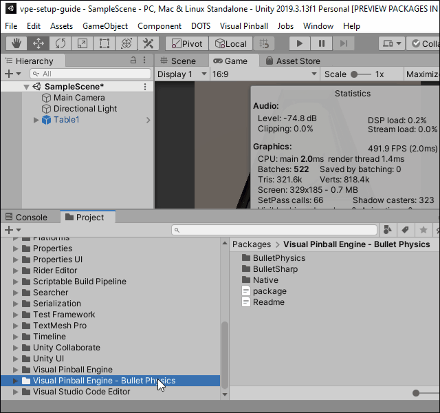
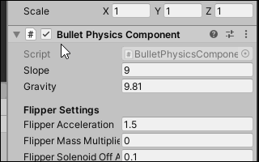

# Bullet Physics Engine for Visual Pinball Engine

Adds Bullet Physics.
**Work in progress.**

## Install VPE
1. Download Visual Pinball Engine, see: `https://github.com/freezy/VisualPinball.Engine`

2. Unzip. For example into `c:\VPE\`

3. Create in Unity new project.

4. Install Visual Pinball Engine with `Package Manager`:

5. Import Visual Pinball table.

## Install Bullet Physics
1. Download, same way as VPE.

2. Unzip. For example int `c:\VPE\`

3. Install with `Package Manager`, same way as VPE.

4. Add GameObject and add to it `Bullet Physics Component`.

5. You can enable / disable Bullet Physics with one click

## FAQ / Troubleshoting
1. If VPE is still in without support of IPhysicsEngine, install VPE from my repo:
`https://github.com/ravarcade/VisualPinball.Engine/zipball/DebugUI`