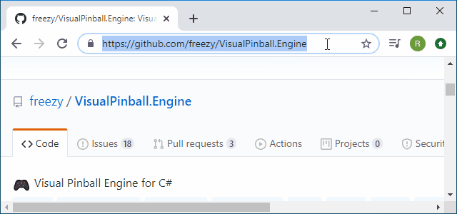
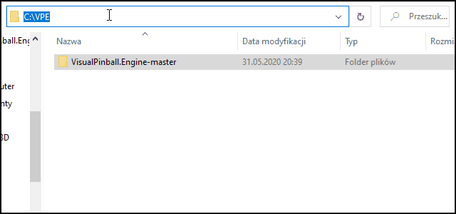
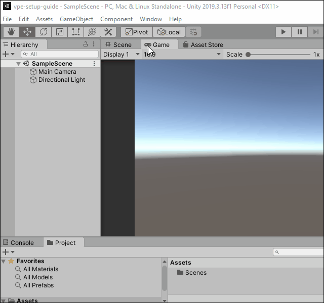
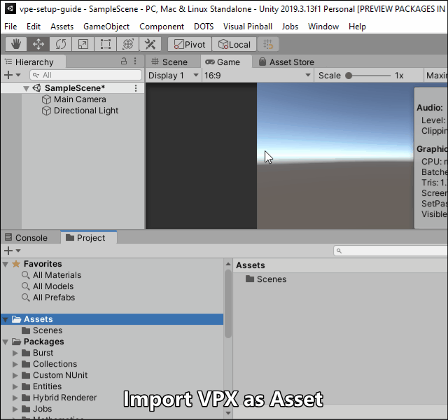
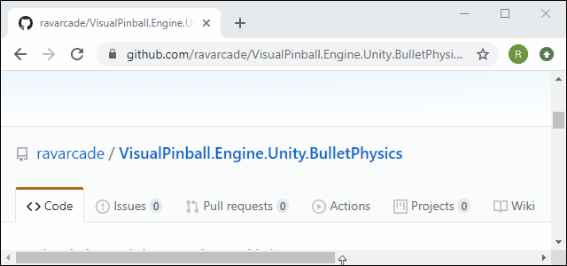
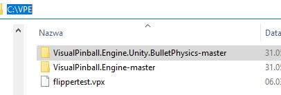
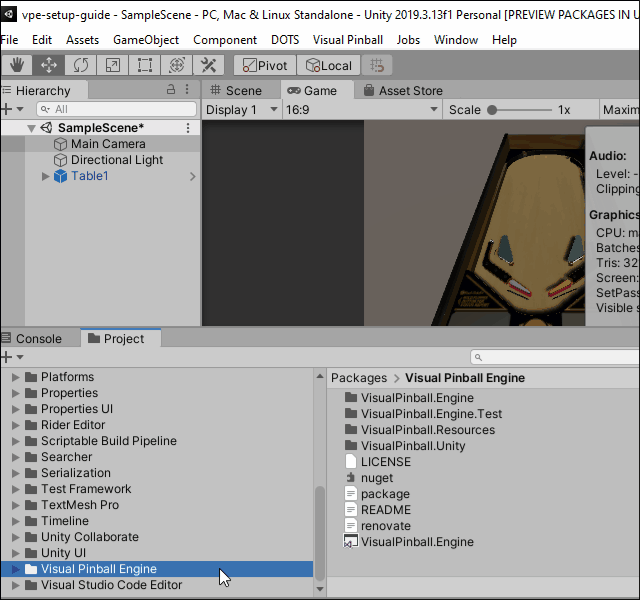
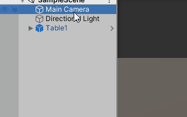

# Bullet Physics Engine for Visual Pinball Engine

Adds Bullet Physics.
**Work in progress.**

## Install VPE
1. Download Visual Pinball Engine, see: `https://github.com/freezy/VisualPinball.Engine`

2. Unzip. For example into `c:\VPE\`

3. Create in Unity new project.

4. Install Visual Pinball Engine with `Package Manager`:

5. Import Visual Pinball table.

## Install Bullet Physics
1. Download, same way as VPE.

2. Unzip. For example int `c:\VPE\`

3. Install with `Package Manager`, same way as VPE.

4. Select **`Bullet Physics`** as `Physics Engine`.

# Credits
- [Bullet Physics Engine](https://github.com/bulletphysics/bullet3)
- [BulletSharp](https://github.com/AndresTraks/BulletSharp) maintained by [AndresTraks](https://github.com/AndresTraks)